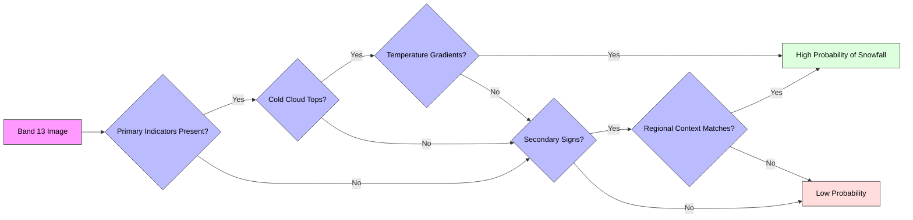

## Interpretation of GOES-19 CONUS - Band 13 Satellite Imagery 

### Primary Indicators

1.  Cold Cloud Tops
          - Very dark gray to black signatures in [Band 13 imagery](https://www.star.nesdis.noaa.gov/GOES/conus_band.php?sat=G19&band=13&length=48&dim=1)
  - Indicates extremely cold cloud tops typical of snow-producing clouds
  - Usually appears darker than surrounding clouds
  - Often forms distinctive comma-shaped or linear patterns

2.  Temperature Gradients
          - Sharp transitions between light and dark areas
  - Dark cores within larger cloud systems
  - Rapid temperature changes along storm boundaries
  - Cold cloud tops extending well above surrounding clouds

### Secondary Confirmation Signs

1. Cloud Organization Patterns
          - Well-defined cloud bands or streaks
  - Organized cloud structures indicating strong lift
  - Cloud layers showing vertical development
  - Distinctive leading edges of cloud systems

2. Regional Context Indicators
          - Alignment with known terrain features
  - Relationship to surface weather stations
  - Correlation with radar precipitation areas
  - Position relative to known weather systems

### Using the Decision Tree

- Start at left with Band 13 imagery analysis
- Follow arrows based on presence/absence of indicators
- Green boxes indicate high probability of snowfall
- Red boxes suggest low probability
- Multiple positive indicators increase confidence in interpretation

This systematic approach helps ensure thorough analysis while reducing the chance of missing important indicators. Always consider multiple factors together rather than relying on single indicators.
